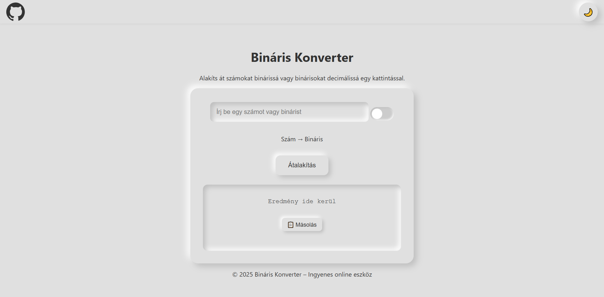

# 🧮 Bináris Konverter Webapp

Egy elegáns, reszponzív és SEO-optimalizált **webalkalmazás**, amely lehetővé teszi a **szám ↔ bináris** átalakítást egyetlen kattintással.  
Az alkalmazás **neumorfikus dizájnnal**, **sötét/világos mód váltással**, és **másolás gombbal** van felszerelve, hogy minden eszközön trendi és használható legyen.

---

## ✨ Főbb jellemzők

- 🔁 **Szám ↔ Bináris** konverzió valós időben
- 🔢 **8 bites** formázás a bináris számokhoz
- 🌗 **Világos/Sötét mód** váltó gomb (helyben tárolt beállítással)
- 📋 **Okos másolás**: csak a számértéket másolja (nincs fölösleges szöveg)
- 🖱️ **Neumorfikus UI** modern árnyékhatásokkal
- 📱 **Mobilbarát**, reszponzív elrendezés
- 🔗 **GitHub repo gomb** beépítve a menüsávba
- 📋 **Vágólapra másolás** visszajelzéssel
- 🔍 **SEO-optimalizált** meta tagekkel
- 📅 Automatikusan frissülő lábléc évszám

---

## 🚀 Live demo

👉 [Tekintsd meg élőben itt](https://github.com/ErikFisherGitHub/bkw) *(Nincs élesítve)*

---

## 📸 Képernyőképek

| Világos mód | Sötét mód |
|-------------|-----------|
|  |  |

---

## 🛠️ Telepítés & használat

```bash
# Klónozd a repót
git clone https://github.com/ErikFisherGitHub/bkw.git

# Lépj be a könyvtárba
cd bkw

# Nyisd meg index.html-t böngészőben
```

Nincs szükség semmilyen backendre – ez egy teljesen **statikus webapp**.

---

## 📁 Mappaszerkezet

```
bináris-konverter/
├── index.html
├── style.css
├── script.js
├── README.md
├── LICENSE
├── .gitattributes
├── .gitignore
└── screenshots/
    ├── light-mode.png
    └── dark-mode.png
```

## 🧱 Fájlszerkezet magyarázata

A projekt fájljai a következő célokat szolgálják:

| Fájl / mappa         | Leírás |
|----------------------|--------|
| `index.html`         | A weboldal belépőpontja – HTML szerkezet |
| `style.css`          | Neumorfikus világos/sötét design |
| `script.js`          | Az app logikája: konverzió, másolás, témaváltás |
| `README.md`          | Ez a dokumentáció, használati útmutatóval |
| `LICENSE`            | Apache License 2.0 – jogi nyilatkozat |
| `.gitattributes`     | Git belső viselkedést szabályoz – nem szükséges letölteni |
| `.gitignore`         | Meghatározza, mit zárjunk ki a verziókövetésből vagy csomagolásból |
| `screenshots/`       | Képernyőképek a README-hez *(helyileg használva, nem kerül letöltésre)*


---

## 💡 Használat

1. Írj be egy **számot** vagy **bináris számot**
2. Válaszd ki az átalakítás irányát a kapcsolóval
3. Kattints az `Átalakítás` gombra
4. Másold ki az eredményt egyetlen kattintással

> A másolás gomb mindig **csak a nyers számértéket** másolja ki, formázás és előtag nélkül!

---

## ⚙️ Technológiák

- ✅ HTML5 + SEO meta elemek
- ✅ CSS3 Neumorphism
- ✅ Vanilla JavaScript (0 függőség)
- ✅ LocalStorage (témaváltáshoz)

---

## 👨‍💻 Fejlesztői tippek

- Könnyedén beépíthető bármilyen weboldalba
- A `script.js` jól tagolt, egyszerűen bővíthető (pl. hexadecimális mód)
- Mobilbarát és gyors – nem igényel semmilyen JS keretrendszert

---

## 📄 Licenc

Ez a projekt az [Apache License 2.0](LICENSE) alatt érhető el.  
Szabadon felhasználhatod, módosíthatod, másolhatod és terjesztheted az alábbi feltételek mellett:

- A szerző(k) nevét és a licencet fel kell tüntetni
- A licencfeltételeket nem lehet eltávolítani vagy megváltoztatni
- A szoftver "AS IS" alapon érkezik, mindenféle garancia nélkül

További részletek: https://www.apache.org/licenses/LICENSE-2.0

---

## 💬 Kapcsolat

Ha tetszett a projekt, vagy kérdésed van, bátran nyiss egy [Issue-t](https://github.com/ErikFisherGitHub/bkw/issues)!

---

> **Pro Tipp:** Ha tetszett, dobj egy ⭐️-t a repóra!
